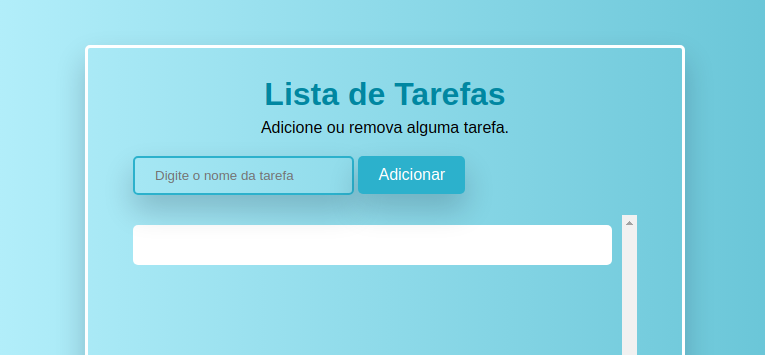

## Sobre o Projeto

> Aplicação dinâmica de uma lista de tarefas, em que se é possível adicionar, remover e concluir atividade.
### Ajustes e melhorias

### Feito com:

* [[HTML5](https://html.spec.whatwg.org/ "HTML5")]
* [[CSS3](https://www.w3.org/Style/CSS/Overview.en.html "CSS3")]
* [[SASS/SCSS] (https://sass-lang.com/ "SASS/SCSS")]
* [[Javascript](http://es6-features.org/ "Javascript")]
---
### Próximos Passos
- [ ] Salvar em LocalStorage
- [ ] Navegação por teclado
---

### Contatos:
 
 

(<a href="#top">back to top</a>)
